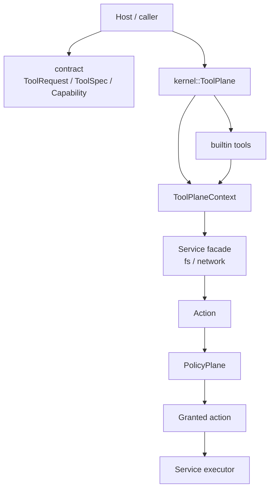

# mvp

A Rust MVP for a layered tool-execution kernel with explicit authorization, audit, and capability propagation.

This repository explores a runtime model for tools that need more structure than “call some function and hope it is safe”.
The core idea is to separate:

- tool protocol and metadata
- kernel-owned execution and authorization
- service access such as filesystem and network
- built-in tools and demo usage

The current codebase is intentionally small, but the layering and safety-oriented design are the main point.

## Goals

This MVP is trying to validate a few ideas:

- tools should run through a kernel-owned invocation pipeline
- service access should be modeled as explicit actions, not ad-hoc direct calls
- authorization should be layered and auditable
- capability constraints should propagate across tool-to-tool invocation
- nested invocation should be able to shrink authority, but not expand it

## Workspace layout

```text
crates/contract   Shared protocol and capability types
crates/kernel     Tool plane, policy plane, actions, audit, services
crates/builtin    Built-in example tools
crates/demo       Demo binary showing end-to-end usage
```

### `crates/contract`

Defines shared runtime-facing types such as:

- `ToolRequest`
- `ToolOutcome`
- `ToolSpec`
- `Capability`
- `Capabilities`

This crate is intentionally lightweight. It describes the protocol surface, not the execution model.

### `crates/kernel`

Owns the execution model and most of the design value in this repository.

Main responsibilities:

- tool registration and invocation
- building per-call runtime context
- capability scoping
- policy evaluation
- grant issuance
- audit logging
- service façades such as filesystem and network

### `crates/builtin`

Contains example tools that exercise the kernel pipeline.

Current examples include:

- `read_file`: reads a file through `ctx.fs()`
- `double`: invokes another tool twice to demonstrate nested invocation

### `crates/demo`

Shows how a host creates a `ToolPlane`, registers tools, installs policy, and invokes tools.

## Layering

The project is deliberately layered.



A few design choices are important here:

1. **Tools do not directly own the runtime pipeline**  
   User code implements `ToolImpl`, but the kernel controls registration, invocation, audit, and final authorization steps.

2. **Services are façades, not raw capabilities**  
   A tool does not read files by directly touching `std::fs`. It goes through `ctx.fs()` and produces an explicit `Action`.

3. **Policy reasons about actions**  
   Authorization is not attached to arbitrary function calls. It is attached to stable, auditable semantic units such as `fs.read` or `network.fetch`.

## Invocation flow

At a high level, a call looks like this:

1. A host calls `ToolPlane::invoke(...)`
2. The kernel looks up the target tool registration
3. The kernel builds a `ToolPlaneContext`
4. The context computes the current `effective_capabilities`
5. The tool parses input and executes
6. If the tool calls a service such as `ctx.fs().read_file(...)`, the service builds an `Action`
7. The `PolicyPlane` evaluates authorization
8. If granted, the action executes against the domain executor
9. Audit records are emitted along the way

For nested tool calls:

1. A tool calls `ctx.invoke_tool(...)`
2. The child invocation inherits the parent effective capabilities by default
3. A tool may explicitly provide a smaller capability override for the child
4. A tool may **not** expand authority beyond its current effective capabilities

## Safety-oriented design efforts

This repository is not claiming to be a finished security system, but a lot of the design effort is aimed at making safety properties explicit.

### 1. Capability model: declared vs effective

A tool has declared capabilities in `ToolSpec`.

Those declared capabilities are treated as the tool’s **default capability set**, not as a permanent hard upper bound.

At runtime, what actually matters is the invocation’s **effective capabilities**. That effective envelope is carried by the kernel per invocation and then enforced by the policy plane during action authorization.

- top-level invocation with `None` override uses the tool’s declared capabilities as default
- top-level invocation with `Some(capabilities)` runs under that explicit effective capability set
- nested invocation with `None` inherits the parent effective capabilities
- nested invocation with `Some(capabilities)` is allowed only if it is a subset of the parent effective capabilities

This matters because it allows wrapper/composition tools such as `double` to exist without forcing every possible delegated service capability into their static declaration.

### 2. Capability non-expansion in nested calls

One of the main safety properties currently enforced is:

> authority may be preserved or reduced across a nested call, but not expanded

So a tool can:

- inherit its current authority to a child tool
- deliberately shrink that authority for a child tool

But it cannot:

- mint new capabilities for a child tool that it does not currently possess

This prevents nested invocation from becoming an authorization bypass.

### 3. Inbound / typed / outbound policy layering

The policy plane now evaluates policies in this order:

1. **inbound global policies**
2. **typed/action-specific policies**
3. **outbound global policies**
4. default deny

The important current use is the inbound capability gate.

#### Inbound

Inbound policy is where hard preconditions live.

Today, the built-in `CapabilityEnvelopePolicy` checks whether:

```text
action.capabilities() ⊆ current effective capabilities
```

If not, the action is denied before any finer-grained resource policy can allow it.

#### Typed / action-specific policy

These policies decide whether a specific resource is allowed.

Examples in the codebase:

- allow exactly one file path
- allow reads under a directory prefix
- allow reads inside the workspace
- allow one exact URL
- allow fetches under a domain suffix

This separation is intentional:

- inbound decides whether the invocation may even attempt the class of action
- typed policy decides whether the concrete resource is acceptable

#### Outbound

Outbound global policy hooks still exist in the policy plane as an extension point for later global authorization logic.

At the moment, this repository does **not** implement an output-authorization subsystem, and the README intentionally does not describe one.

### 4. Deny-by-default

If no policy grants an action, the action is denied.

This is a small but important default. The system does not silently fall through to implicit allow.

### 5. Service isolation

Filesystem and network access are modeled as kernel-owned services.

This gives a few benefits:

- tools get a stable API like `ctx.fs()` and `ctx.network()`
- authorization logic stays centralized
- audit records can be attached to semantic actions
- executor implementations can be swapped independently from policy logic

### 6. Workspace boundary checks

For filesystem reads, the path is canonicalized and checked to remain under the workspace root before execution.

This helps prevent obvious path-escape issues such as `../` traversal from bypassing workspace boundaries.

### 7. Auditability

The kernel emits structured audit events around:

- tool invocation
- action grant attempts
- grant allow / deny
- action execution start / finish / error
- effective capability scope
- nested capability overrides
- attempted nested capability expansion

The current audit logs are intentionally verbose enough to explain not only *what happened*, but also *why a decision was made*.

## Current examples

### `read_file`

`read_file` demonstrates a straightforward service-backed tool:

- declared capability: `FsRead`
- implementation calls `ctx.fs().read_file(...)`
- actual file access still requires matching policy, such as `AllowWorkspaceReadPolicy`

### `double`

`double` demonstrates nested tool invocation.

Its own declared capabilities are empty. That is deliberate.

It can still successfully invoke `read_file` when the host gives the top-level invocation an explicit effective capability override that includes `FsRead`.

This shows the distinction between:

- static declaration
- invocation-time effective authority

## Current non-goals and limitations

This is an MVP, so some things are intentionally incomplete.

### No dedicated tool-invocation capability yet

Tool-to-tool invocation is supported, but there is not yet a first-class `Action` / `Capability` specifically modeling “invoke another tool”.

That would be a natural next step if this system grows.

### Limited service surface

The current repository only has fleshed-out examples for:

- filesystem reads
- network fetches

The `Capability` enum already hints at broader domains, but those services are not yet implemented here.

### URL parsing is still MVP-grade

The current network example uses a simple host extraction helper rather than a fully normalized URL model.

That is fine for an MVP, but not something to oversell as production-grade URL authorization.

### `ToolOutcome.classification` is not described as a security boundary

The shared contract still contains `ToolOutcome.classification`, but this README does not treat it as an enforced authorization layer.

## Why this design is interesting

Many MVP tool systems collapse these concerns together:

- tool logic
- side effects
- authorization
- audit
- delegation

This repository deliberately does not.

The value of this codebase is less about “how many tools exist today” and more about the fact that it already separates:

- **what a tool wants to do**
- **what action that becomes**
- **what policy says about it**
- **what authority the current invocation actually has**
- **what gets recorded for later inspection**

That separation is what makes later hardening possible.

## Quick start

Run tests:

```sh
cargo test --workspace
```

Run clippy:

```sh
cargo clippy --workspace --all-targets -- -D warnings
```

Run formatting check:

```sh
cargo fmt --all -- --check
```

Run the demo:

```sh
cargo run -p mvp-demo
```

## Suggested next steps

If this MVP continues, the most natural follow-ups are:

1. model tool-to-tool invocation as its own action / capability
2. add more service domains such as process / secret / time
3. harden URL handling for network policy
4. expand audit schema and documentation
5. add integration-style tests for larger invocation chains

---

This project is small on purpose. The main artifact is the execution model and the safety-oriented layering, not feature count.
