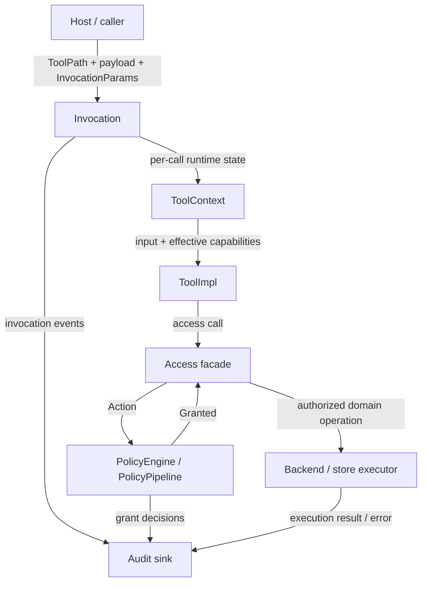

# mvp

A Rust MVP for a layered tool-execution architecture with explicit capabilities,
policy checks, access mediation, and audit records.

The project is intentionally small. Its main artifact is the runtime architecture:
tools do not perform side effects directly; they request kernel-owned access facades,
which turn requests into auditable actions and authorize them through policy.

## Start here

The whole design can be summarized as:

```text
ToolImpl
  -> Access facade
  -> Action
  -> PolicyEngine / PolicyPipeline
  -> Granted<Action>
  -> Executor
  -> Audit
```

Read these first:

- [docs/architecture.md](docs/architecture.md): the runtime model and reading
  path
- [docs/design.md](docs/design.md): design-purpose index for each important type
  and pattern

If you want to jump straight into code, read in this order:

1. `crates/kernel/src/action.rs`
2. `crates/kernel/src/policy/decision.rs`
3. `crates/kernel/src/policy/traits.rs`
4. `crates/kernel/src/policy/grant.rs`
5. `crates/app/src/policy_pipeline.rs`
6. `crates/access-fs/src/access.rs`
7. `crates/access-fs/src/action.rs`
8. `crates/access-fs/src/policy.rs`
9. `crates/access-network/src/access.rs`
10. `crates/access-monty/src/access.rs`
11. `crates/kernel/src/audit.rs`
12. `crates/app/src/lib.rs`
13. `crates/tool-builtin/src`
14. `crates/tool-monty/src/lib.rs`

## Architecture goals

- Keep protocol types separate from runtime execution.
- Route all tool side effects through access facades.
- Represent access operations as explicit `Action` values.
- Evaluate coarse capabilities before resource-specific policy.
- Preserve or reduce authority across nested tool calls, never expand it.
- Emit audit records around invocation, authorization, and execution.

## Workspace layout

```text
crates/contract   Shared protocol, metadata, capabilities, invocation params
crates/kernel     Kernel traits, tool context, actions, policy, grants, audit
crates/access-fs      Filesystem access facade, actions, backend, policies
crates/access-network Network access facade, actions, backend, policies
crates/access-monty   Monty session access, actions, store, policies
crates/tool-builtin    Example Rust tools that exercise the architecture
crates/tool-monty      Monty-backed tool runtime and Monty OS bridge
crates/app        Concrete application kernel wiring tools, access, policy
crates/test-support    Test helpers shared across crates
examples/demo.rs       Small end-to-end executable example
```

## Logical layers



The logical architecture is about runtime responsibility:

- **Host / caller** supplies the target tool path, JSON payload, and
  `InvocationParams`.
- **Invocation** resolves the target tool and creates the per-call context.
- **Tool context** carries workspace root, effective capabilities, access facades, and
  nested invocation.
- **Tool context** exposes access facades, not kernel or backend handles.
- **Tool implementation** parses input and asks the context for domain access.
- **Access facade** converts side-effect requests into semantic actions and
  executes only after policy returns a grant.
- **Policy engine** decides whether an action is denied or returned as
  `Granted<Action>` by the kernel-owned grant path.
- **Executor** performs the authorized domain operation.
- **Audit** records invocation events, grant decisions, and execution results.

## Implementation layers

```text
example demo
  depends on app + tool-builtin + tool-monty

app
  concrete Kernel implementation and runtime wiring

tool-builtin / tool-monty
  ToolImpl implementations

access-fs / access-network / access-monty
  concrete access facades, actions, backends or stores, resource policies

kernel
  reusable traits, policy model, grants, audit, action flow

contract
  shared request/outcome/spec/capability types
```

The implementation layout is about code ownership and dependency direction.
`contract` is the lowest shared layer. `kernel` defines reusable runtime
mechanics without concrete access domains. Access crates plug side-effect
domains into the shared action, policy, grant, and audit flow. `app` wires those
mechanics and access facades into a concrete kernel. Tool crates supply tools that can
run on that kernel-facing abstraction. `examples/demo.rs` composes the pieces.

### `contract`

`mvp-contract` defines the shared protocol surface:

- `ToolOutcome`
- `ToolSpec`
- `Capability` / `Capabilities`
- `InvocationParams`

This crate does not own execution. It only describes what can cross the runtime
boundary.

### `kernel`

`mvp-kernel` defines the reusable execution model:

- `Kernel` and `ToolContext` traits
- tool registration and invocation adapters
- `Action` and `Granted<Action>` authorization flow
- `PolicyEngine` trait and kernel-owned `grant` flow
- structured audit helpers

The kernel crate contains the design primitives, but not the concrete application
state or concrete side-effect access domains.

### `access-*`

Access crates define concrete side-effect domains:

- `mvp-access-fs` owns filesystem canonical path types, fs actions, fs access facade,
  backend traits, and fs policies.
- `mvp-access-network` owns network fetch actions, network access facade, backend
  traits, and URL policies.
- `mvp-access-monty` owns Monty session load/save actions, session access facade,
  session store traits, and session policies.

Each access crate uses the kernel's shared `Action`, `PolicyEngine`,
`Granted<Action>`, `ActionExecutor`, and audit flow. Actions carry policy and
audit metadata; backend or store executors own domain execution.

### `app`

`mvp-app` is the concrete kernel implementation used by the example demo and
tests.

It wires together:

- registered tools
- `StdFsBackend`
- `DenyNetworkBackend`
- `MemoryMontySessionStore`
- `PolicyPipeline`
- `CapabilityEnvelopePolicy`
- `AllowMontySessionPolicy`
- per-call `AppToolContext`

This crate is where invocation parameters become an effective runtime context.

### `tool-builtin`

`mvp-tool-builtin` contains small tools that demonstrate the model:

- `read_file` uses `ctx.fs().read_file(...)`
- `write_file` uses `ctx.fs().write_file(...)`
- `double` performs nested tool invocation

These tools are examples, not the architectural center of the repository.

### `tool-monty`

`mvp-tool-monty` contains tools that run Monty code through the same kernel
boundary:

- `MontyTool` runs Monty snippets and can expose registered host tools as Monty
  functions.
- `MontyOsTool` handles supported Monty OS calls, such as `Path.read_text` and
  `Path.write_text`, by routing them through access facades like `ctx.fs()`.
- Monty REPL state is loaded and saved through `ctx.monty_sessions()`, so session
  persistence remains policy-mediated and auditable.

Run the end-to-end example with:

```sh
cargo run --example demo
```

## Invocation model

A top-level call enters through `Kernel::invoke`:

1. The application finds the registered tool.
2. The application builds a `ToolContext`.
3. The context computes effective capabilities for this invocation.
4. The tool executes against the context.
5. Access calls create explicit actions such as `fs.read` or `network.fetch`.
6. The policy engine evaluates the action.
7. A granted action executes through the backend or store.
8. Audit records describe the invocation, grant decision, and execution result.

Nested calls use the same path through `ToolContext::invoke_tool`. By default,
the child inherits the parent invocation's effective capabilities. A child call
may receive a smaller override, but an override that expands authority is denied.

## Capability model

`ToolSpec.capabilities` is a tool's declared default capability set. It is not
the only authority source for every call.

The actual authorization envelope is the invocation's effective capabilities:

- top-level call without override uses the target tool's declared capabilities
- top-level call with override uses that explicit envelope
- nested call without override inherits the parent envelope
- nested call with override must stay within the parent envelope

This makes composition tools possible without allowing delegated calls to mint
new authority.

## Policy model

Actions are authorized by the `PolicyEngine` trait. The app's `PolicyPipeline`
evaluates them in this order:

1. inbound global policies
2. typed action-specific policies
3. outbound global policies
4. default deny

The app's `CapabilityEnvelopePolicy` is an inbound gate:

```text
action.capabilities() subset_of current_effective_capabilities
```

If the action exceeds the current envelope, it is denied before any
resource-specific policy can allow it.

Typed policies decide whether a concrete resource is acceptable, for example:

- exact file read/write
- workspace file read/write
- exact URL fetch
- domain-suffix URL fetch

If no policy grants an action, the action is denied.

Each policy returns a `PolicyGrant` containing:

- `decision`: `allow`, `deny`, or `abstain`
- `reason`: human-readable explanation
- `predicate`: diagnostic predicate recorded in DEBUG audit

This keeps policy-specific explanations with the policy while leaving emission,
`Granted<Action>` construction, and final grant handling centralized in
`PolicyEngine::grant` inside `mvp-kernel`.

## Access model

Access facades are kernel-owned facades over side-effect domains.

Current domains:

- filesystem read/write
- network fetch
- Monty session load/save

The facade constructs an action, asks policy for a grant, and only then delegates
the granted action to a backend or store executor. This keeps tool logic,
authorization, audit, and domain I/O in separate layers.

Backends perform direct domain operations. Tools receive access facades such as
`ctx.fs()`, `ctx.network()`, or `ctx.monty_sessions()`, not backend or store
handles, so ordinary tool code cannot bypass authorization.

Filesystem access canonicalizes paths against the workspace root before
authorization and execution. Existing write targets are canonicalized directly;
new targets are checked by canonicalizing the parent directory and then
re-attaching the file name.

The fs model uses canonical path types so policy comparisons happen in one path
space:

- `CanonicalPath` for action resources
- `CanonicalRoot` for workspace containment
- `CanonicalPrefix` for prefix policies

## Audit model

Audit records are emitted around:

- tool invocation
- effective capability scope
- nested capability override decisions
- attempted nested capability expansion
- per-policy evaluation diagnostics at DEBUG level
- grant allow/deny decisions
- action execution start, finish, and error

The audit layer is deliberately verbose for an MVP because the architecture is
meant to make authorization decisions inspectable.

Audit events use stable dot-separated names such as `grant.allow`,
`grant.deny`, `policy.evaluate`, `execute.start`, `execute.finish`, and
`execute.error`. They include query-friendly fields such as `phase`, `action`,
`grant_id`, `resource_kind`, `resource`, `policy_name`, and `reason`. Optional
fields are omitted when absent.

Final authorization records such as `grant.allow` and `grant.deny` are INFO.
Per-policy `policy.evaluate` records are DEBUG because they explain the
evaluation path rather than the final authorization fact.

The demo keeps the default human-readable tracing output:

```sh
cargo run --example demo
```

Set `MVP_LOG_FORMAT=json` to emit newline-delimited JSON audit logs on stdout
with current span and span list metadata. The demo writes its sample outcomes to
stderr in this mode so stdout remains machine-readable:

```sh
MVP_LOG_FORMAT=json RUST_LOG=mvp::audit=debug cargo run --example demo
```

Set `MVP_TRACE_EXPORTER=otlp` to export the same tracing spans to an
OpenTelemetry-compatible backend. For a local graphical trace view, run Jaeger
with OTLP enabled:

```sh
docker run --rm --name jaeger \
  -p 16686:16686 \
  -p 4317:4317 \
  -p 4318:4318 \
  -p 5778:5778 \
  -p 9411:9411 \
  cr.jaegertracing.io/jaegertracing/jaeger:2.19.0
```

Then run the demo and open `http://localhost:16686`; the service name is
`mvp-demo`. The demo defaults to OTLP/HTTP on
`http://localhost:4318/v1/traces`. Jaeger's `4317` port is OTLP/gRPC; `4318` is
OTLP/HTTP.

```sh
MVP_TRACE_EXPORTER=otlp RUST_LOG=mvp::audit=debug cargo run --example demo
```

`OTEL_EXPORTER_OTLP_ENDPOINT` can override the default
`http://localhost:4318/v1/traces` trace endpoint.

## Current boundaries

This repository does not claim to be a finished security system.

Known MVP boundaries:

- filesystem, network, and Monty session access domains are examples rather than a
  complete access catalog
- URL handling is intentionally simple
- Monty OS support currently covers selected calls only
- `ToolOutcome.classification` exists in the contract but is not enforced as an
  output authorization boundary
- only tools are included in this kernel

The design value is the separation between tool intent, semantic actions, policy
decisions, effective authority, authorized domain execution, and audit.
