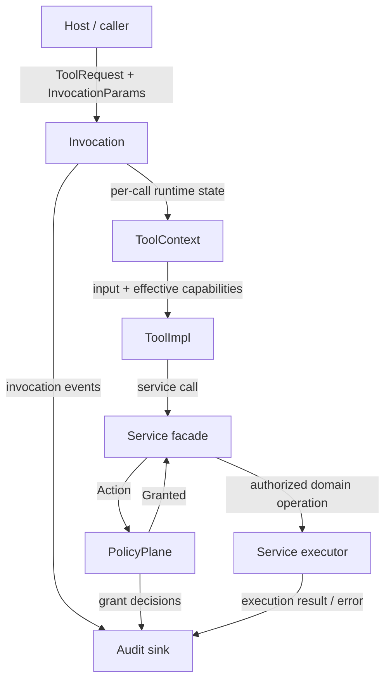

# mvp

A Rust MVP for a layered tool-execution architecture with explicit capabilities,
policy checks, service mediation, and audit records.

The project is intentionally small. Its main artifact is the runtime architecture:
tools do not perform side effects directly; they request kernel-owned services,
which turn requests into auditable actions and authorize them through policy.

## Architecture goals

- Keep protocol types separate from runtime execution.
- Route all tool side effects through service facades.
- Represent service operations as explicit `Action` values.
- Evaluate coarse capabilities before resource-specific policy.
- Preserve or reduce authority across nested tool calls, never expand it.
- Emit audit records around invocation, authorization, and execution.

## Workspace layout

```text
crates/contract   Shared protocol, metadata, capabilities, invocation params
crates/kernel     Kernel traits, tool context, actions, policy, services, audit
crates/app        Concrete application kernel wiring tools, services, and policy
crates/builtin    Example tools that exercise the architecture
crates/demo       Small end-to-end executable
```

## Logical layers



The logical architecture is about runtime responsibility:

- **Host / caller** supplies `ToolRequest` and `InvocationParams`.
- **Invocation** resolves the target tool and creates the per-call context.
- **Tool context** carries workspace root, effective capabilities, services, and
  nested invocation.
- **Tool implementation** parses input and asks the context for service access.
- **Service facade** converts side-effect requests into semantic actions and
  executes only after policy returns a grant.
- **Policy plane** decides whether an action is denied or returned as
  `Granted<Action>`.
- **Executor** performs the authorized domain operation.
- **Audit** records invocation events, grant decisions, and execution results.

## Implementation layers

```text
demo
  depends on app + builtin

app
  concrete Kernel implementation and runtime wiring

builtin
  example ToolImpl implementations

kernel
  reusable traits, policy engine, service facades, audit, action flow

contract
  shared request/outcome/spec/capability types
```

The implementation layout is about code ownership and dependency direction.
`contract` is the lowest shared layer. `kernel` defines reusable runtime
mechanics. `app` wires those mechanics into a concrete kernel. `builtin` supplies
tools that can run on that kernel-facing abstraction. `demo` composes the pieces.

### `contract`

`mvp-contract` defines the shared protocol surface:

- `ToolRequest`
- `ToolOutcome`
- `ToolSpec`
- `Capability` / `Capabilities`
- `InvocationParams`

This crate does not own execution. It only describes what can cross the runtime
boundary.

### `kernel`

`mvp-kernel` defines the reusable execution model:

- `Kernel` and `ToolContext` traits
- tool registration and invocation adapters
- `Action` and `Granted<Action>` authorization flow
- inbound, typed, and outbound policy evaluation
- filesystem and network service facades
- structured audit helpers

The kernel crate contains the design primitives, but not the concrete application
state.

### `app`

`mvp-app` is the concrete kernel implementation used by the demo and tests.

It wires together:

- registered tools
- `StdFs`
- `DenyNetwork`
- `PolicyPlane`
- `CapabilityEnvelopePolicy`
- per-call `AppToolContext`

This crate is where invocation parameters become an effective runtime context.

### `builtin`

`mvp-builtin` contains small tools that demonstrate the model:

- `read_file` uses `ctx.fs().read_file(...)`
- `write_file` uses `ctx.fs().write_file(...)`
- `double` performs nested tool invocation

These tools are examples, not the architectural center of the repository.

## Invocation model

A top-level call enters through `Kernel::invoke`:

1. The application finds the registered tool.
2. The application builds a `ToolContext`.
3. The context computes effective capabilities for this invocation.
4. The tool executes against the context.
5. Service calls create explicit actions such as `fs.read` or `network.fetch`.
6. The policy plane evaluates the action.
7. A granted action executes through the service executor.
8. Audit records describe the invocation, grant decision, and execution result.

Nested calls use the same path through `ToolContext::invoke_tool`. By default,
the child inherits the parent invocation's effective capabilities. A child call
may receive a smaller override, but an override that expands authority is denied.

## Capability model

`ToolSpec.capabilities` is a tool's declared default capability set. It is not
the only authority source for every call.

The actual authorization envelope is the invocation's effective capabilities:

- top-level call without override uses the target tool's declared capabilities
- top-level call with override uses that explicit envelope
- nested call without override inherits the parent envelope
- nested call with override must stay within the parent envelope

This makes composition tools possible without allowing delegated calls to mint
new authority.

## Policy model

Actions are authorized by `PolicyPlane` in this order:

1. inbound global policies
2. typed action-specific policies
3. outbound global policies
4. default deny

The built-in `CapabilityEnvelopePolicy` is an inbound gate:

```text
action.capabilities() subset_of current_effective_capabilities
```

If the action exceeds the current envelope, it is denied before any
resource-specific policy can allow it.

Typed policies decide whether a concrete resource is acceptable, for example:

- exact file read/write
- workspace file read/write
- exact URL fetch
- domain-suffix URL fetch

If no policy grants an action, the action is denied.

## Service model

Services are kernel-owned facades over side-effect domains.

Current domains:

- filesystem read/write
- network fetch

The facade constructs an action, asks policy for a grant, and only then delegates
to the executor. This keeps tool logic, authorization, audit, and domain I/O in
separate layers.

Filesystem access also canonicalizes paths against the workspace root before
execution. Existing write targets are canonicalized directly; new targets are
checked by canonicalizing the parent directory and then re-attaching the file
name.

## Audit model

Audit records are emitted around:

- tool invocation
- effective capability scope
- nested capability override decisions
- attempted nested capability expansion
- grant allow/deny decisions
- action execution start, finish, and error

The audit layer is deliberately verbose for an MVP because the architecture is
meant to make authorization decisions inspectable.

## Current boundaries

This repository does not claim to be a finished security system.

Known MVP boundaries:

- tool-to-tool invocation is not yet modeled as its own action/capability
- only filesystem and network service examples are fleshed out
- URL handling is intentionally simple
- `ToolOutcome.classification` exists in the contract but is not enforced as an
  output authorization boundary

The design value is the separation between tool intent, semantic actions, policy
decisions, effective authority, service execution, and audit.
